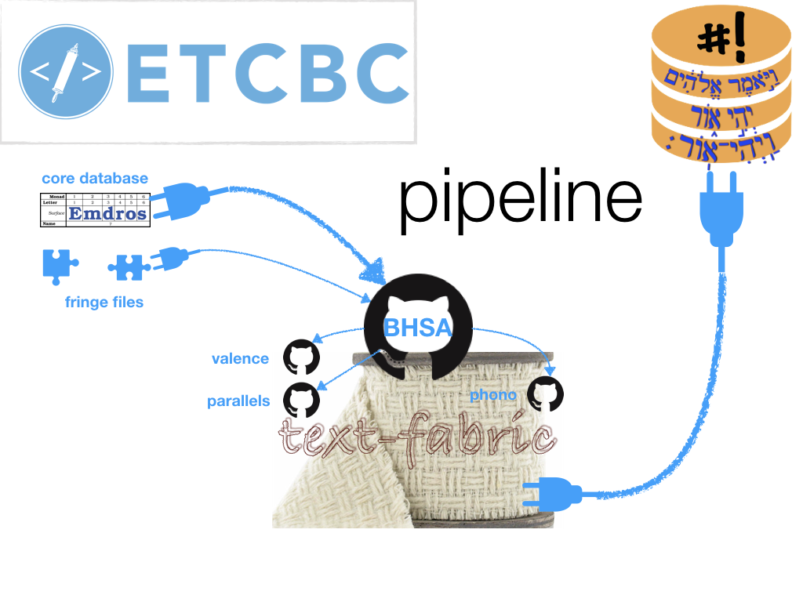

# Pipeline

[ Software Heritage Archive](https://archive.softwareheritage.org/browse/origin/https://github.com/etcbc/pipeline/)

[](https://doi.org/10.5281/zenodo.1153961)



# About
This is the connection between the Amsterdam Hebrew data of the 
[ETCBC](http://etcbc.nl)
and the website
[SHEBANQ](https://github.com/ETCBC/shebanq/wiki/Sources)
of
[DANS](https://dans.knaw.nl/en/front-page?set_language=en).

# Portable ETCBC data
This pipeline delivers, among other good things, a file `bhsa_xx.mql.bz2`
which contains all ETCBC data and research additions to it.
The form is MQL, compressed, and the size is less than 30 MB.
Where ever you have [Emdros](https://emdros.org) installed,
you can query this data.

If you take this file from the continuous version,
[right here](https://GitHub.com/ETCBC/bhsa/tree/master/SHEBANQ/c),
the data is also state-of-the-art, less than a week old,
provided the pipeline is executed frequently.

# Two pipes
This repo contains a pipeline in software by which the ETCBC can update its public data sources.
The pipeline has two main pipes:
* [ETCBC to TF](https://GitHub.com/ETCBC/pipeline/blob/master/programs/tfFromEtcbc.ipynb)
* [TF to SHEBANQ](https://GitHub.com/ETCBC/pipeline/blob/master/programs/shebanqFromTf.ipynb).

Between the two pipes there is a set of open GitHub repositories that contain the data
in a compact, text-based format,
[text-fabric](https://GitHub.com/Dans-labs/text-fabric/wiki),
which is uniquely suited to frictionless data processing.

Only the first pipe has been fully developed so far,
the second one only partly.

# Purpose
The public data of the ETCBC is live data, in the sense that it is actively
developed at the ETCBC.
Mistakes are corrected, new insights are carried through,
and the fruits of research are added as enrichments.

**The ETCBC wants to expose its current data to researchers and to the public.**

All public incarnations of the ETCBC data at a given point in time should be in sync.

The refresh rate should be at least weekly, preferably more frequent.

# Buffer function
The ETCBC does not yet produce a data export that satisfies all the requirements posed by users
further down the line.
Especially SHEBANQ is fussy about the details of the text-carrying features,
of which the contents and organization have changed from version `4` to `4b` to `2016`.
Sometimes features are missing in the export, and have to be reconstructed from other data,
sometimes values seem to have been mangled somewhere in the creation workflow.

This pipeline is a useful tool to work around those issues
temporarily and to provide feedback to the ETCBC,
which will hopefully lead to a more consistent data interface over time.

# Versioning
The pipeline produces *versions* of the whole spectrum of interconnected ETCBC data.
There will be fixed versions (`2017`, `2019`, ...) and a continuous version (`c`).
Version `c` is the one to receive the weekly updates.

The name of the version is the most important parameter of the pipeline.

## Summary of the pipeline

### [ETCBC to TF](https://GitHub.com/ETCBC/pipeline/blob/master/programs/tfFromEtcbc.ipynb)
The ETCBC dumps the BHSA data source on a weekly basis, and pushes it
to the [BHSA](https://GitHub.com/ETCBC/bhsa) repo.
The data consists of:
* a big MQL dump with most of the features,
* several related data files in other formats, containing the lexicon, ketiv-qere data and paragraph numbers.

From there this pipeline takes over.
The BHSA repo contains the notebooks to convert this all to a text-fabric data set, called **core**.

But this is not all.

The ETCBC maintains additional GitHub repositories.
* [valence](https://GitHub.com/ETCBC/valence) (verbal valence),
* [parallels](https://GitHub.com/ETCBC/parallels) (parallel passages),
* [phono](https://GitHub.com/ETCBC/parallels) (phonetic transcription).
These repos contain methods to produce new data from core data and to deliver
that data as new text-fabric data modules.

When the pipeline runs, it finds those methods and executes them.

### [TF to SHEBANQ](https://GitHub.com/ETCBC/pipeline/blob/master/programs/shebanqFromTF.ipynb).
This part of the pipeline:
* aggregates all text-fabric data (core plus modules) to one big MQL file,
* compiles all the text-fabric data into website friendly MYSQL databases,
* compiles annotation sets from the relevant text-fabric data modules, such as `parallels` and `valence`.
  
## Post pipeline steps

### After ETCBC to TF
All repos involved should commit and push to GitHub, in order for the outside world to see the changes.
For each `repo` (currently: `bhsa`, `phono`, `parallels`, `valence`)

```sh
cd ~/GitHub/etcbc/repo
git add --all .
git commit "pipeline has run"
git push origin master
```

**Caveat**
It is wise to perform a `git pull origin master` after the commit,
in case other users have committed changes to GitHub.


### After TF to SHEBANQ
The following steps should be done at the production server:
* the aggregated MQL is imported into a live Emdros database,
  the database against which the SHEBANQ queries are executed;
* the MYSQL databases are imported into the live MYSQL database system,
  which powers the display of SHEBANQ text and data views;
* the generated annotation sets are imported in the notes database (also a MYSQL database),
  from where SHEBANQ fetches all manual annotations for display next to the text in notes view.
  Existing incarnations of these note sets should be deleted first.

# Operation
The pipeline is coded as a Jupyter notebook, but it can also be run as a script,
by converting it first to plain Python.

The individual repositories also code their data processing in Jupyter notebooks.
When the pipeline runs, it find these notebooks, converts them, and runs them in a special mode.

The benefit of this approach is, that the data processing per repo can be developed
interactively in a notebook, without any pipeline concern.

Later, the bits that are needed for the pipeline, can be brought under the scope of the special mode.

If the pipeline runs these notebooks, and they produce errors,
you can go to the faulty notebook, run it interactively,
diagnose the misbehaviour and fix it.

## Script mode
Here is how the pipeline runs a notebook
* convert the notebook to python with
  [nbconvert](https://nbconvert.readthedocs.io/en/latest/);
* read the script as file and execute it as a python string, through the built-in
  [exec()](https://docs.python.org/3.6/library/functions.html#exec) function;
* supply arguments to the script by injecting them directly into 
  [locals()](https://docs.python.org/3.6/library/functions.html#locals).

We adopt the convention that the pipeline passes a boolean parameter `SCRIPT` with
value `True` to each notebook that it runs in this way.

Every notebook in the pipeline has to check (first thing) whether the variable `SCRIPT` is among
the `locals()`.

If not, the script knows that a user in interacting with it.
In that case, it is handy to set the remaining parameters that are relevant to the
pipeline to the values that you want for your interactive sessions, e.g.

```python
if 'SCRIPT' not in locals():
    SCRIPT = False
    FORCE = True
    CORE_NAME = 'bhsa'
    VERSION = 'c'
    CORE_MODULE ='core' 
```

These settings will not be seen by the pipeline!
When run by the pipeline, `'SCRIPT' in locals()` is true,
and the variable assignments in this cell do not take place.
Instead, the pipeline injects particular values for these variables.

Effectively, the notebook has turned into a generic function, to which you can pass parameters.

So the pipeline can run a notebook several times in a row for different versions,
without the need to change the notebook in any way.

When you compute interactively with the notebook, you may want to do things
that are not relevant to the pipeline.

That is easy. Just put your things under:

```python
if not SCRIPT:
    # my things ...
```

or even better, define the function

```
def stop(good=False):
    if SCRIPT: sys.exit(0 if good else 1)
```

and take care that in script mode this function is called at the end of the operations
relevant for the pipeline:

```python
success = lastOperation(data)
stop(good=succes)
```

Whatever you do in cells after this statement, it will not be reached by the pipeline.

**Caveat**
In interactive mode, after running the cell with `if 'SCRIPT' not in locals()`, 
we will have `SCRIPT == False`.
That means, from then on the variable `SCRIPT` exists and `'SCRIPT' in locals()` is true.

So, if you, in your interactive session, want to change from `VERSION = 'c'` to
`VERSION = '2017'`, 
you'll discover that this statement is not executed.

The best way to overcome this is to restart the kernel of the notebook.

If you do not want to loose your variables, just say

```python
if not SCRIPT: VERSION = '2017'
```

so that the pipeline operations do not get overridden by your specific choice.
